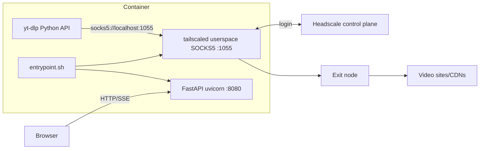

# What `tailscaled-yt-dlp` does

## Purpose

A Dockerized web application for downloading video/audio with **yt-dlp**, with **all download-related traffic routed through a Tailscale VPN exit node** using a local SOCKS5 proxy (`localhost:1055`). It targets users who want geographic or network egress control (for example, to download as if from the exit node) and self-hosted Tailscale via **Headscale**.

## High-level architecture

- **[entrypoint.sh](entrypoint.sh)** starts `tailscaled` with `--tun=userspace-networking --socks5-server=localhost:1055`, waits for the socket, installs a CLI wrapper **`y`** that runs `yt-dlp` with `--proxy socks5://localhost:1055`, then runs **`uvicorn app.main:app`** on `0.0.0.0:8080`.
- **[app/downloader.py](app/downloader.py)** configures yt-dlp with the same SOCKS proxy, cookies, user-agent, Node for JS challenges, ffmpeg merge/postprocess, and enforces a concurrency limit. It records jobs in SQLite, broadcasts progress via SSE, and supports live streams (with stop), retries, and format selection.
- **[app/vpn.py](app/vpn.py)** and the **`tailscale`** CLI connect to Headscale, list/set exit nodes, and **`VPNMonitor`** polls `tailscale status --json` every ~30s, reconnecting from saved config if disconnected.

## Web application ([app/main.py](app/main.py))

| Area | Behavior |
| ---- | ---------- |
| **Setup** | Before first use: wizard connects to Headscale, lists exit nodes, saves credentials + VPN config + hashed password ([app/auth.py](app/auth.py)). |
| **Auth** | Session tokens (PBKDF2-hashed passwords; tokens stored in a JSON file under the data directory, persisted across restarts). |
| **Downloads** | `GET /api/formats`, `POST /api/downloads`, list/delete/patch; file download and streaming with token in header or query. |
| **Realtime** | `GET /api/events?token=` — SSE for download progress and VPN status (EventSource cannot send `Authorization`, hence query token). |
| **Categories** | CRUD under `/api/categories` — optional organization of downloads. |
| **Share links** | Time-limited public URLs under `/s/{token}` with optional password; short-lived **share access tokens** for stream/download after password. |
| **Settings** | `public_url` for absolute share URLs; credential change; VPN settings update (reconnect). |
| **Health** | `/api/health` and VPN-related endpoints (`/api/vpn/status`, `/api/vpn/ip`, disconnect, change exit node). |

Static **PWA** assets live under [static/](static/) (`index.html`, `sw.js`, `manifest.json`).

## Data and persistence

- **SQLite** ([app/database.py](app/database.py)) — downloads, categories, share links.
- **Config** — JSON on disk (paths from [app/config.py](app/config.py)) — username, password hash/salt, Headscale URL/auth key, exit node, optional `public_url`.
- **Volumes** (per [README.md](README.md)): `/downloads` (media), `/data` (DB, cookies, tokens), `/var/lib/tailscale` (Tailscale state).

## Container image ([Dockerfile](Dockerfile))

Alpine-based: Python 3, pip deps from [requirements.txt](requirements.txt), ffmpeg, tailscale, node (for yt-dlp JS), curl. **Capabilities**: `NET_ADMIN` and `/dev/net/tun` are documented for compose; **userspace** mode reduces the need for kernel TUN for the SOCKS path, but the project still documents standard Tailscale requirements.

## CI / distribution

[.github/workflows/build.yml](.github/workflows/build.yml) builds multi-arch images; images are published as `zuptalo/tailscaled-yt-dlp` and GHCR (per README).

## Summary

**In one sentence:** it is a **self-hosted, authenticated web UI around yt-dlp** that **forces downloads through a Tailscale exit node** (Headscale-friendly), with **SQLite history**, **SSE progress**, **optional categories**, **shareable links**, and a **small CLI wrapper** inside the container for manual `yt-dlp` use through the same VPN.
